# NexusOSS Sonartype Repository
* It is a Software Repository: Storage location for software packages
* Our own repo for softwares/packages are: 
- Maven: Maven dependencies
- apt: Packages for debian based systems
- yum: packages for RedHat based systems
- nuget: package manager for .NET
- NPM: package manager for javascript
- Docker: registry to store Docker images
- Etc.

* Nexus Software Repository Manager:
- Runs on java
- Used to store artifacts
- Used as a package manager for dependencies
- Opensource & Entreprise versions
- Supports Variety of repo like maven, apt, docker, Ruby gems etc.
nexus_integration

* Step 1: SignIn into Nexus server and create new repository
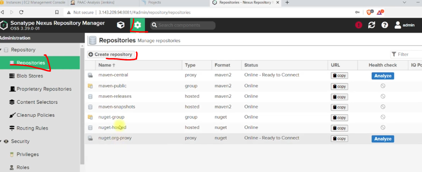
Choose maven2 hosted => to store artifacts (maven2 proxy to retrieve artifatcs.PNG)
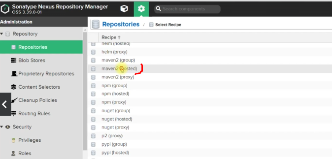
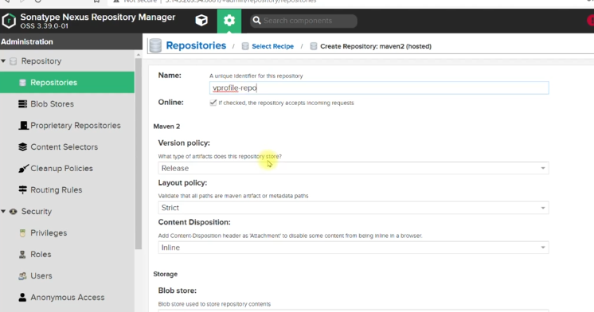

* Step 2: Setup Nexus cridentials on jenkins
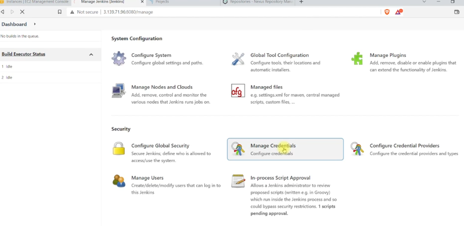
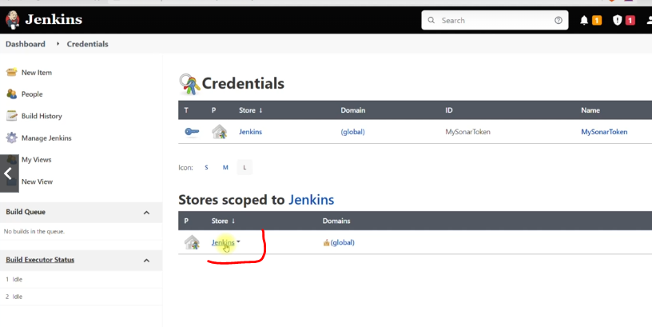
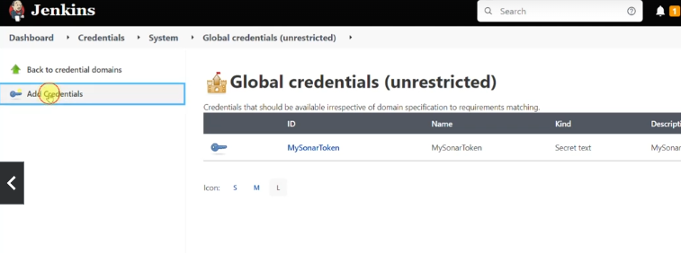
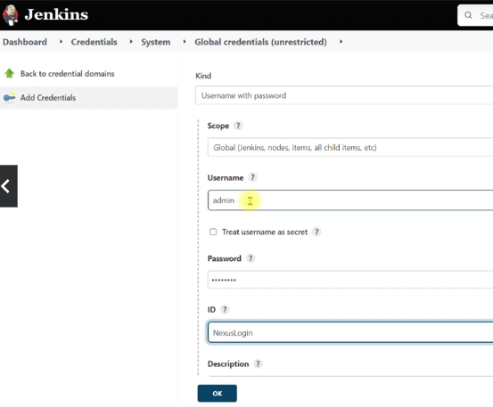
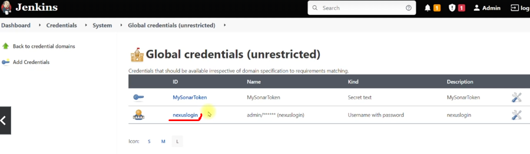

* Step 3: configure timestamp tool
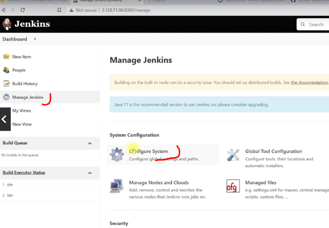
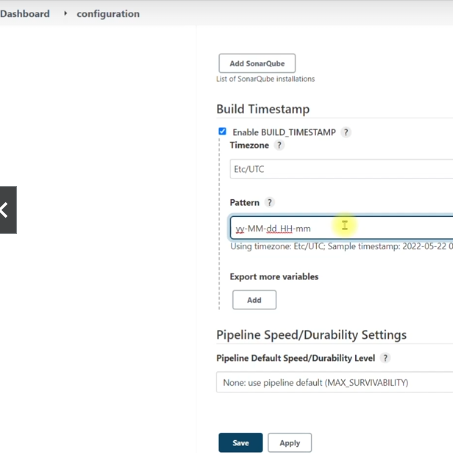

* step 4: change everywhere public ip by private ip. 
- in sonar use jenkins private ip under project settings
- in jenkins settings use sonar and nexus private ips 
* Step 5: use Jenkinsfile4 and update the pipeline script and run.
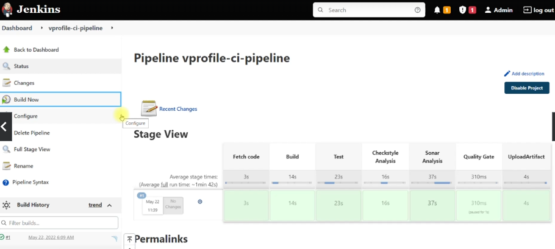

Check the result
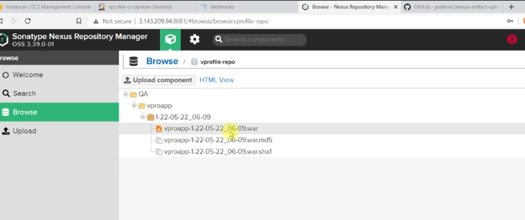
