# SonarQube
* Step 1: Create EC2 instance
Name: SonarServer
AMI: Ubuntu 20.04
Instance Type: t2.meduim 2vcpu 4 Gi
keybair: sonar-key.pem
Security Group: sonar-sg
Inboud rule 1: SSH 22 from my IP
Inbound rule 2: Custom TCP from My IP port 80
Inbound rule 3: Custom TCP from jenkins-sg port 80
User data: sonar-setup.sh
* Step 2: Access sonarqube from a browser
Copy public ip of Ec2 instance and open it in a browser without specifying any port
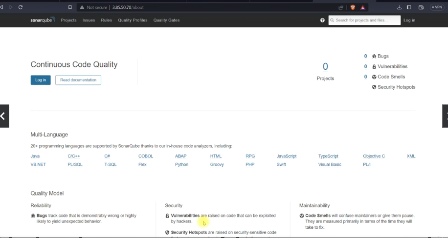
* Step 3: Login
Click on the button at the top right 'Sign In' and use default user/password: admin/admin
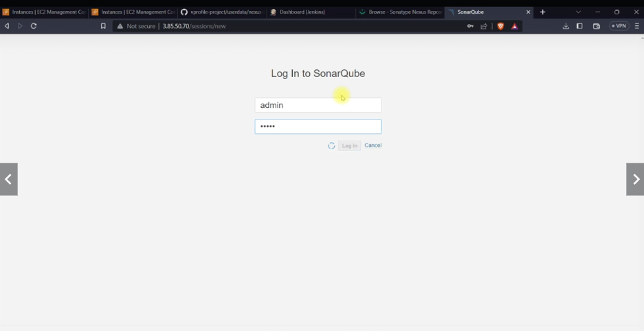

## Install SonarQube Scanner tool
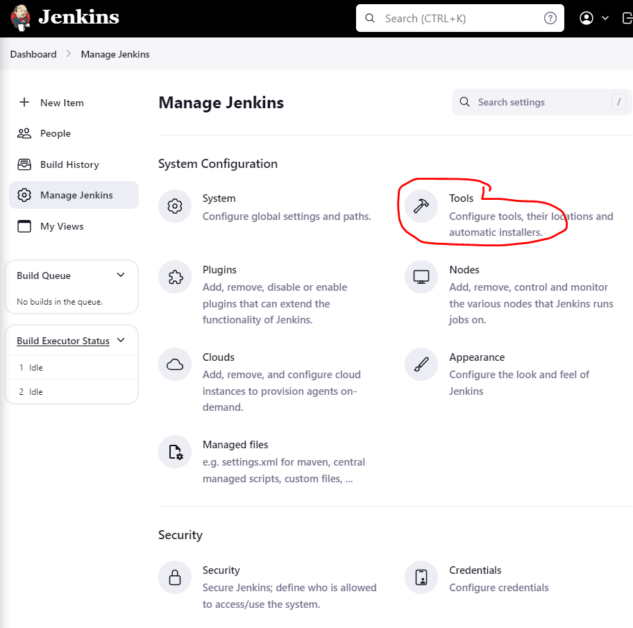
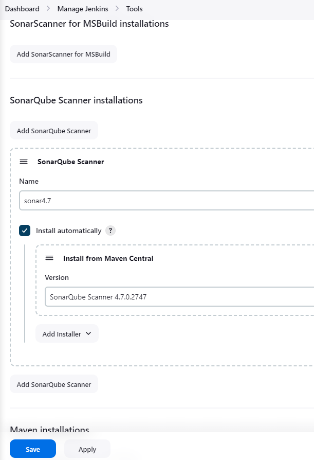
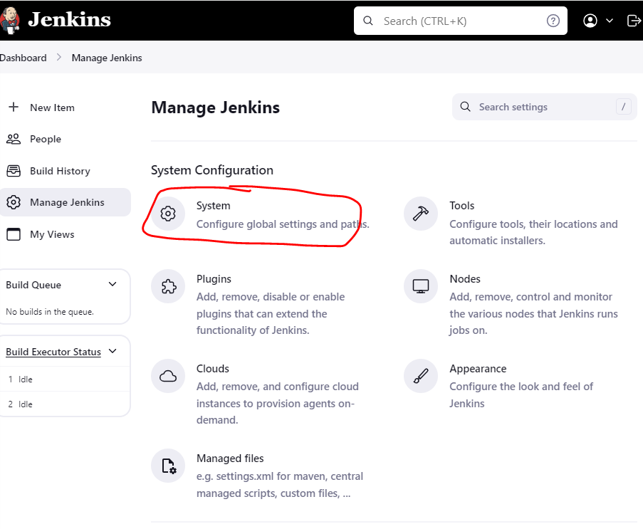
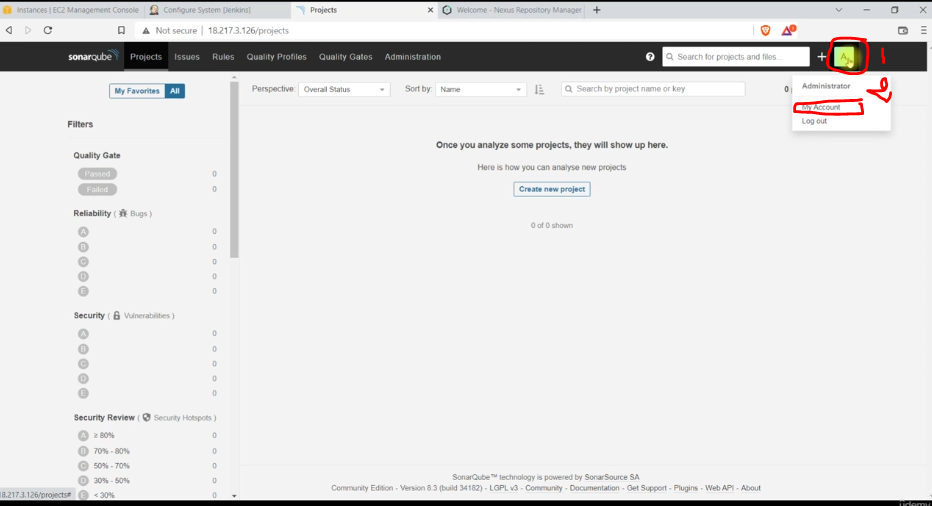
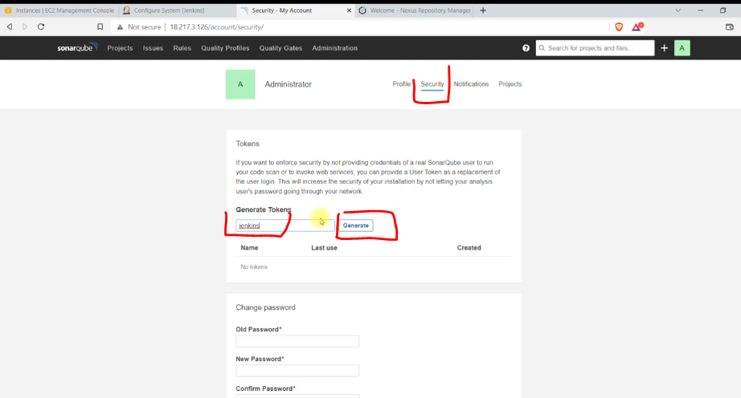
Copy the generated token
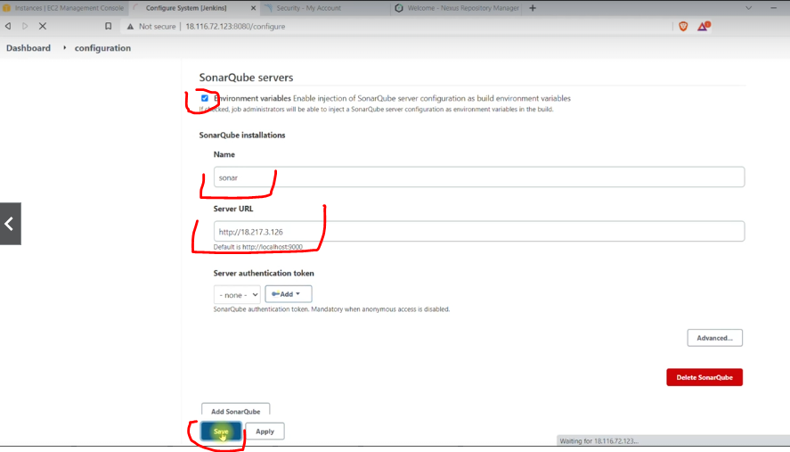
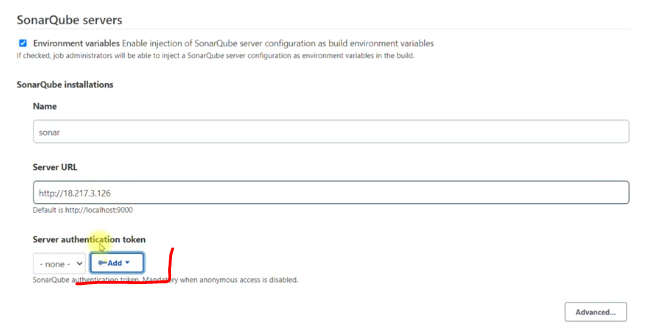
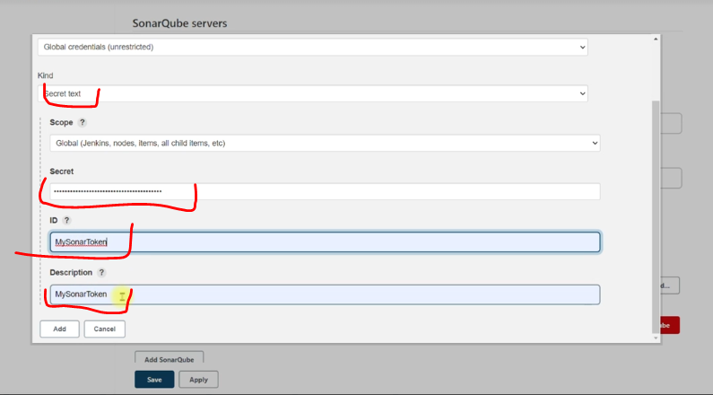

## Checkstyle pipeline
* Step create new pipeline 
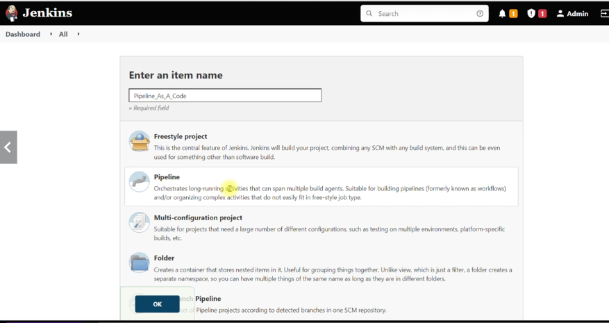
* Copy script from /samples/Jenkinsfile2 and paste it into "Script" section and save.
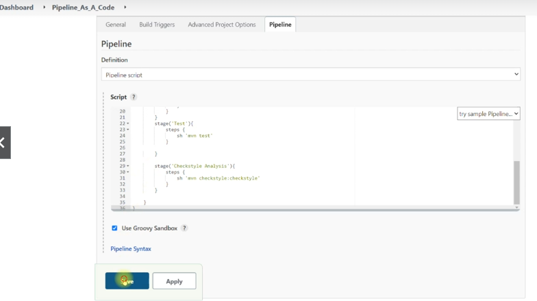
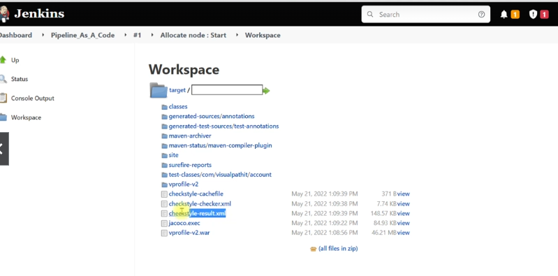
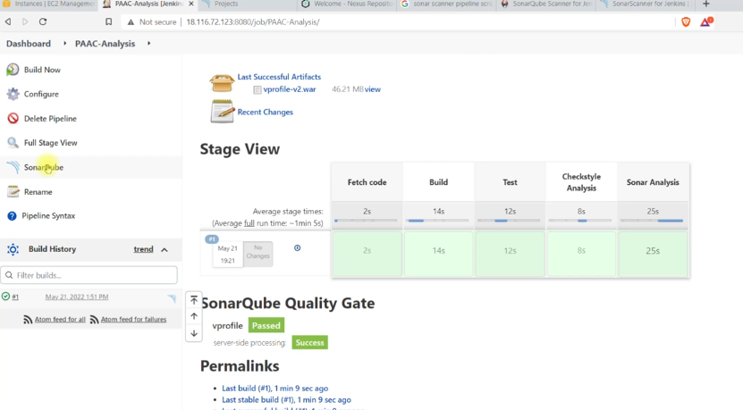
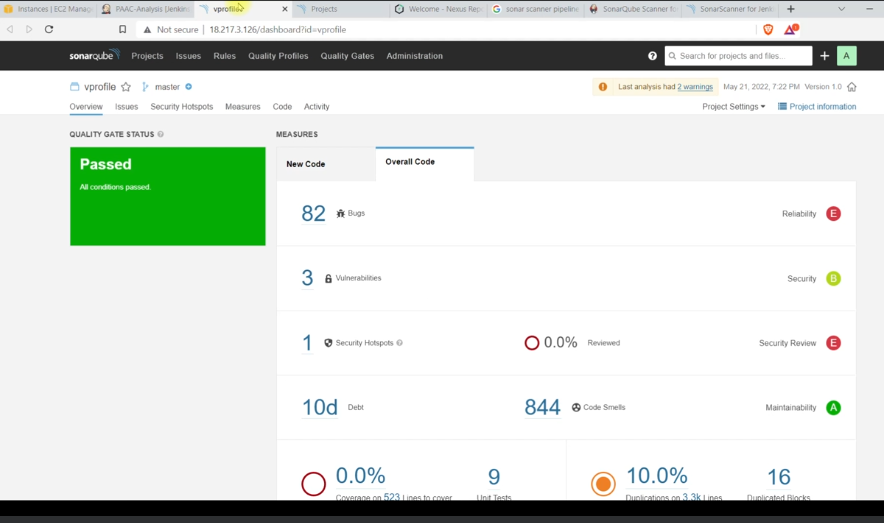

## Quality Gate
Setup the server
* Step 1: Create quality gate rule 

* Step 2: Link the quality gate to the project on sonar

* Step 3: Send the information to jenkins, create a webhook

Copy jenkins ec2 instance private IP and use it in the url of the webhook

Note: if jenkins-sg does not allow http on port 8080 from anywhere we should add inbound rule to allow from sonarqube sg

* Step 4: Update jenkins pipeline script and run build.
Use script in file /samples/Jenkinsfile
* Step 5: check the result

