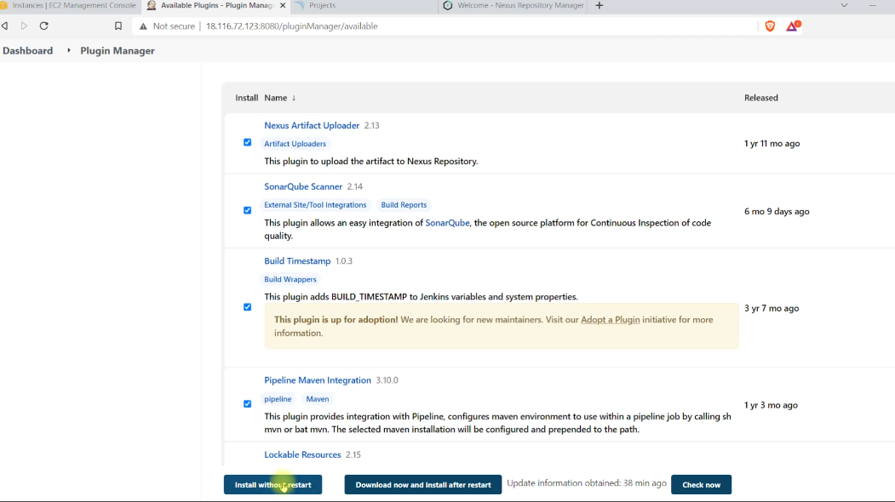
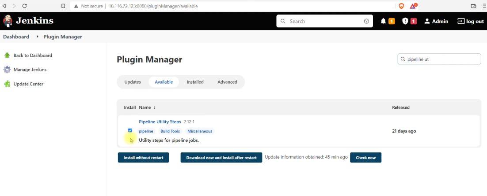
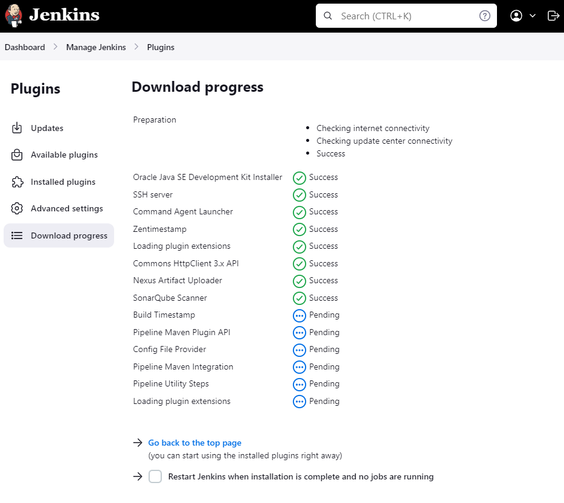
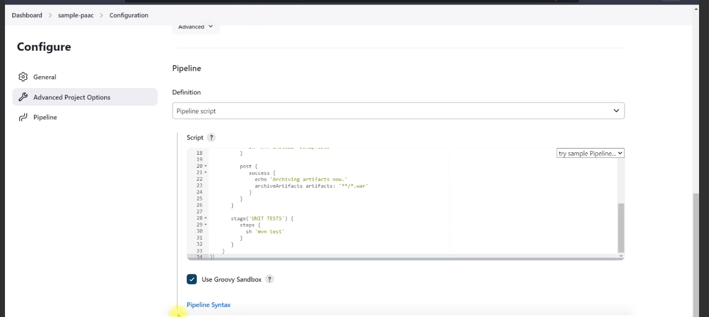
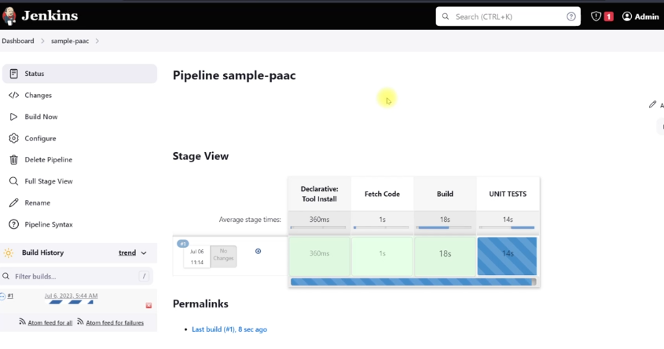
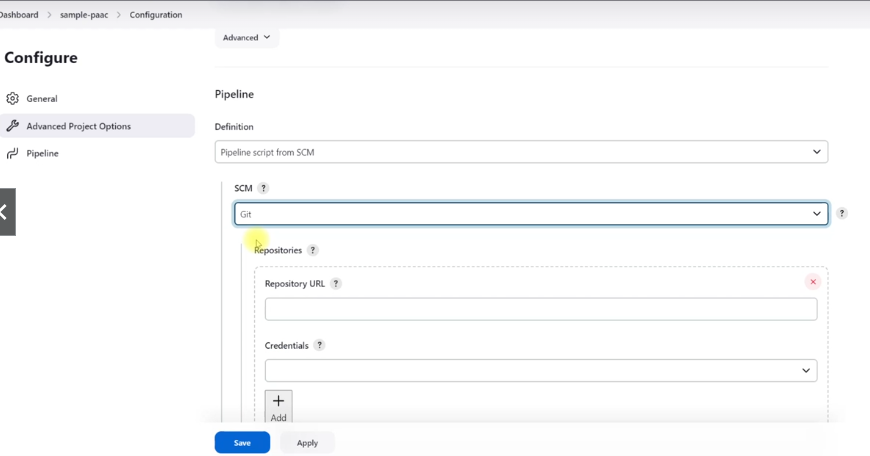
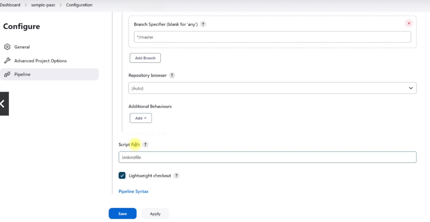

# Pipeline As A Code
## Introduction
* Automate pipeline setup with Jenkins
* jenkinsfile defines Stages in CI/CD Pipeline
* Jenkinsfile is a text file with Pipeline DSL Syntax
* Similar to groovy
* Two Syntax
- Scipted
- Declarative

## Concepts:
* Pipeline
* Node/agent
* Stage
* Step

## Paac vs freestyle
* Pipeline created in groovy
* recommended now

## Syntax
```
pipeline {
  agent: {

  }
  tools {

  }
  environment {

  }
  stages {

  }
}
```
* Agent
```
pipeline {
  agent {
    label: "matser"
  }
}
```
* Tools
```
pipeline {
  tools {
    maven "Maven3"
  }
}
```
* Environment
```
pipeline {
  environment {
    NEXUS_VERSION = "nexus3"
    NEXUS_PROTOCOL = "http
    NEXUS_URL = "your-ip-addr-here:8081"
    NEXUS_REPOSITORY = "maven-nexus-repo"
    NEXUS_CREDENTIAL_ID = "nexus-user-credentials"
    ARTIVERSION = "${env.BUILD_ID}"
  }
}
```
* Stages
```
pipeline {
  stages {
    stage("Clone code from VCS") {
      
    }
    stage("Maven Build") {
      steps {
        sh 'mvn clean install'
      }
      post {
        success {
          echo 'Now Archiving...'
          archiveArtifacts artifacts: '**/target/*.war'
        }
      }
    }
    stage("Publish to Nexus Repository Manager") {
      
    }
  }
}
```
## Install Plugins
* Nexus Artifact Uploader
* SonarQube Scanner
* Build Timestamp
* Pipeline maven integration
* Pipeline Utility Steps


And

Click Install


## First Pipeline
* Create new job type Pipeline named sample-paac using pipeline from script option. Use script /samples/Jenkinsfile1


Save and build


Or using pipeline code from the git repository within source code


And


## Code Analysis
Code analysis check:
* Best Practices of coding
* Vulnerabilities in code
* Functional Errors before deployment

## Code Analysis Tools
* Checkstyle
* Cobertura
* mstest
* owasp
* Sonarqube Scanner
* Etc.
