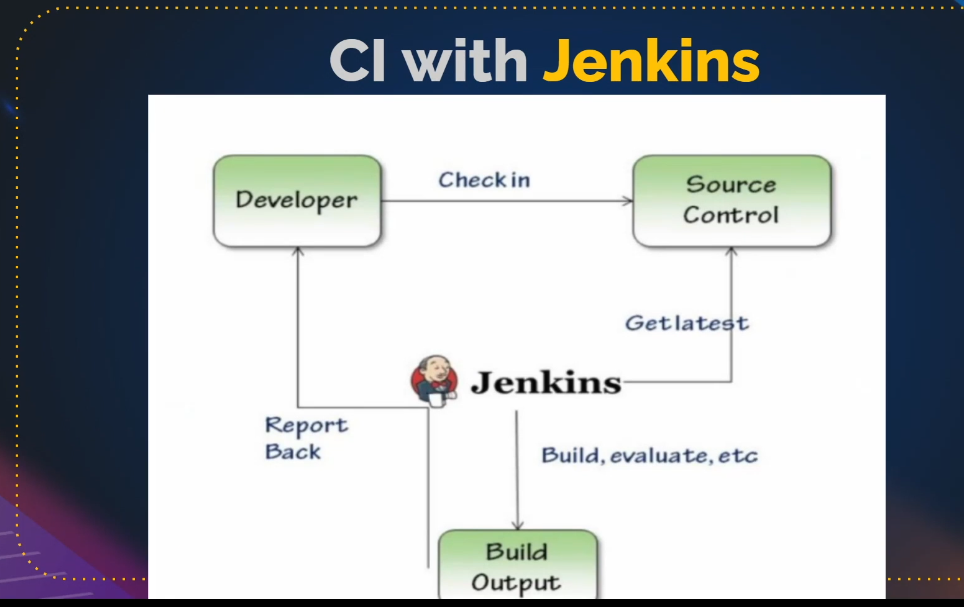

# Jenkins
## CI: Continuous Integration
jenkins CI automatizes the process of build, evaluate report and notify, etc after each push of developers on source code remote repo.
(see screenshot jenkins-CI.png)

## If not working

### Features
