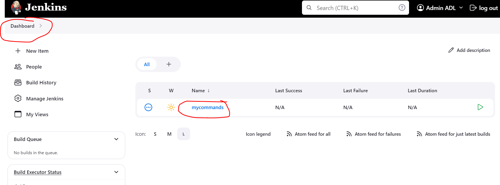

# Jenkins
## CI: Continuous Integration
jenkins CI automatizes the process of build, evaluate report and notify, etc after each push of developers on source code remote repo.

### Features
* Open Source
* Extensible:
Because of its OpenSource jenkins it is extensible. It integrates many plugins such as:
- VCS Plugin: Plugin for version control system to integrate jenkins with all vesion cntrl systems
- Build Plugin: you can build java, node, .NET, ... any source code by their build tools.
- Cloud Plugin
- Testing Plugin
- Etc.

### Installations
Prerequis:
- Java JRE and JDK
- Any OS
Go to "https://www.jenkins.io/" and choose "/Documentations/Install Jenkins section"
```
#!/bin/bash

sudo apt update

sudo apt install openjdk-11-jdk -y

sudo wget -O /usr/share/keyrings/jenkins-keyring.asc \
  https://pkg.jenkins.io/debian-stable/jenkins.io-2023.key

echo "deb [signed-by=/usr/share/keyrings/jenkins-keyring.asc]" \
  https://pkg.jenkins.io/debian-stable binary/ | sudo tee \
  /etc/apt/sources.list.d/jenkins.list > /dev/null

sudo apt-get update

sudo apt-get install jenkins -y
```
* Go to AWS console EC2
* Create new EC2 instance with this config
- name: Jenkinsserver
- AMI: Ubuntu 20.04 TLS free tier
- Instance Type: t2.micro 1vCPU 1Gi Free tier
- Create new key pair with name jenkins-key
- Edit network settings: 
- create new security group named jenkins-SG and inbound rule SSH from MY IP and new inbound rule: type custom TCP, port 8080 from MY IP
- use the script above as User Data to install jenkins on the instance
- launch the instance

* SSH to the instance
When the instance is ready in a running state copy the public IP and use it to ssh into the instance.
```
$ ssh -i jenkins-key.pem ubuntu@<public-ip>
```
* Check installed java and jenkins
```
$ java -version
java 11 jdk installed ...
$ systemctl status jenkins
active state ...
# Check jenkins home directory
$ ls /var/lib/jenkins
# Check jenkins user
$ id jenkins
uid=114(jenkins) gid=120(jenkins) groups=120(jenkins)
```
### Use jenkins
* Access jenkins from a browser: copy its public IP and set it with the default port 8080 <public-id>:8080 in browser search input and hit enter.
* copy the password from installed jenkins server
```
$ sudo cat /var/lib/jenkins/secrets/initialAdminPassword
```
* paste the password and connect
* choose select plugin to install
* read all plugin that will be installed, unselect Ant plagin and click install
* create new user
admin
admin12345
Admin ADL
admin@mydevops.com
* save
### Job Types in Jenkins
* Freestype
* Pipeline As A Code
#### Freestyle JOB
* Graphical Jobs
From graphic UI we click on create a job and configure and run the job to see the output.
* the problem is we can have many and many job, we need to connect many jobs together manually one by one.
* For learning, understanding & exploring Jenkins purposes and understand the concept
* Not recommended in Real time now.
#### Pipeline As A Code
* Pipeline created in groovy
* recommended now

#### Examples
* Freestyle Job example
- we need tools and plugins, we can install them through Manage jenkins.

- that to install tools we need plugins. By default we have just a small list of tools that we can install like JDK, Maven, Git, Gradle but if we want more we need to install plugins 
* Install JDK 11 tool
- Click Add JDK
- SSH into EC2 instance where jenkins is installed and get jdk 11 path 
JDK are installed under /usr/lib/jvm/
```
$ ls /usr/lib/jvm/
$ ls /usr/lib/jvm/java-1.11.0-openjdk-amd64
$ cd java-1.11.0-openjdk-amd64$
$ pwd
/usr/lib/jvm/java-1.11.0-openjdk-amd64
```

* Install JDK8 tool
- Install Open JDK 8 on ec2 instance
```
$ sudo apt update
$ sudo apt install openjdk-8-jdk -y
$ ls /usr/lib/jvm/
$ cd java-1.8.0-openjdk-amd64
$ pwd
/usr/lib/jvm/java-1.8.0-openjdk-amd64
```

* Install Maven tool
- Click Add Maven button

* Save
* You can check installed tools by clicking on the same buttons Manage jenkis , tools
and check each installation.
* For git tool, it is already installed by default in jenkins if it is installed on ubuntu OS.
### Create Jobs
We will create a sample job to execute some shell commands.
* Step 1

* Step 2

* Step 3

* Step 4

* Step 5

* Step 6

* Step 7

* Step 8: Check workspace of the job. normally if there is a file generated with the job it will be shown under workspace section of the job.

* Step 9

* Step 10

* Step 11

* Step 12

* Step 13


## Create Job for git
* Create freestyle job with name BuildGitVprofile
* Step 1: choose the jdk tool

* Step 2: specify the source code repository url. we can change the cridentials or specify ssh config.

* Step 3: define the build step of maven

* Step 4: choose the jdk oracle 11 and save and after that run a new build.

 The build takes lots of time because of the instance type t2.micro. we need to change the instance type. Then stop the instance and if it takes lots of time to stop then force stop the instance.
* Step 5: change instance type.

* Step 6: choose instance type t2.small

* Step 7: restart the instance and copy public id and access jenkins from the browser using the same user/password. Nothing was lost even the config, jobs still the same.

* Step 8: The build is finished with success

* Step 9: we see the build result. In target folder there is the war file of the project. we can remove the content of the workspace of the job by clicking on the button "Wipe Out Current Workspace".

* Step 10: click configure, and post-build action and specify a reg exp for the artifactory file to save.

* Step 11: click build now and after build finish click on build id to see the result.

* Step 12: the artifactory is displayed and it will not be removed if we clean the workspace of the job.


### Copy Job from other one and use a default took already installed on jenkins server
* Step 1: Put A name for the new job

* Step 2: write previous job name in search input. It will appear in the result and select it

* Step 3: use maven default

* Step 4: Job failure because of not found mvn command

* Step 5: Intall maven on jenkins

* Step 6: check maven version

* Step 7

## Jenkins Environment Variables
In this lecture we will see three types of jenkins environment variables:
* Default jenkins variables: like BUILD_ID
* Parameter variables
* Plugin variables.

### Job versioning builds
* Step 1: create new freestyle job named "versioning-builds" copy from "BuildGitVprofile".
* Step 2: remove copied post build action
* Step 3: create new build step "Execute shell".
Jenkins Environment variables: https://wiki.jenkins.io/display/JENKINS/Building+a+software+project
Save and start build the job two times.

This is the result. Two war files copied to versions folder.

* Step 4: Make the project parameterized.
Add a String parameter.

User the version parameter in execute shell build step.

Now we don't have anymore the button "build now" but we have new button "build with parameters".

The result:

* Step 5: Add plugin


* Step 6: Install Zentimestamp

* Step 7: Change date pattern for BUILD_TIMESTAMP variable for our job and use it.

Use the BUILD_TIMESTAMP variable.

Don't forget to uncheck the checkbox "This project is parameterized" to not have anymore to set the variable VERSION manally.
Build Now the job and check the result.


## Pipeline

### Nexus
* Step 1: Create EC2 instance with 
Name: NexusServer
AMI: centos 7
Instance Type: t2.meduim 2 vcpu 4 Gi
Keypair: nexus-key.pem
Security group: nexus-sg:
Inboud rule 1: SSH 22 from my IP
Inbound rule 2: Custom TCP from My IP port 8081
Inbound rule 3: Custom TCP from jenkins-sg port 8081
User Data: nexus-setup.sh

* Step 2: Sign up
Copy public ip of the Ec2 instance and open it in a browser use port 8081.


### SonarQube
* Step 1: Create EC2 instance
Name: SonarServer
AMI: Ubuntu 20.04
Instance Type: t2.meduim 2vcpu 4 Gi
keybair: sonar-key.pem
Security Group: sonar-sg
Inboud rule 1: SSH 22 from my IP
Inbound rule 2: Custom TCP from My IP port 80
Inbound rule 3: Custom TCP from jenkins-sg port 80
User data: sonar-setup.sh
* Step 2: Access sonarqube from a browser
Copy public ip of Ec2 instance and open it in a browser without specifying any port

* Step 3: Login
Click on the button at the top right 'Sign In' and use default user/password: admin/admin
