# Terraform
* IAAC | Automate Infrastructure
* Define Infrastructure State
* Ansible, puppet or chef automates mostly OS related tasks.
  - defines machines state
* Terraform automates infra itself
  - Like AWS, GCP, Azure, digital ocean etc.
* Terraform works with automation softwares like ansible after infra is setup and ready
* No Programming, its own syntax similar to JSON.

## Installation on windows
  - download zip file from https://www.terraform.io/
  - extract zip file and move binary file (.exe) to c:/tools/devops-utilities to be defined in the path variables.
```
$ terraform version
Terraform v1.9.2
on windows_386 
```

* Install awscli tools using chocoloty
```
$ choco install awscli
```

* create new aws user
  - go to aws console
  - IAM -> Users
  - create new user: 
    - terradmin
    - attach exsiting policies directly "AdministratorAccess"
  - create user
  - Create access key
  - cli
  - download cridentials it should contain: secret key details
* open powershell
```
$ aws configure
# provide access key details
```

Now we have aws cli configured on our laptop. We can now use terraform, it has acces then to aws.

## Exercices

### Exercice 1: create sample ECE instance

For that we need to create two things on AWS
- create key par
- create security group with inbound rule: custom tcp port 22 from my IP Addr

```
$ terraform init
# previous command downloaded aws provider plugins
$ ls .terraform/
```

Do some validations before creating aws

```
$ terraform validate
╷
│ Error: Unsupported argument
│
│   on first_instance.tf line 9, in resource "aws_instance" "intro":
│    9:     key-name = "dove-key"
│
│ An argument named "key-name" is not expected here. Did you mean "key_name"?

```

Fix syntax errors and retry

```
$ terraform validate
Success! The configuration is valid.

```

Format your code

```
$ terraform fmt
```

* check terraform plan before creating the instance

Now terraform plan will show us the plan of terraform if we ask terraform to create the ec2 instance for us.

```
$ terraform plan

Terraform used the selected providers to generate the following execution
plan. Resource actions are indicated with the following symbols:
  + create

Terraform will perform the following actions:

  # aws_instance.intro will be created
  + resource "aws_instance" "intro" {
      + ami                                  = "ami-080fa3659564ffbb1"
      + arn                                  = (known after apply)
      + associate_public_ip_address          = (known after apply)
      + availability_zone                    = "eu-west-3a"
      + cpu_core_count                       = (known after apply)
      + cpu_threads_per_core                 = (known after apply)
      + disable_api_stop                     = (known after apply)
      + disable_api_termination              = (known after apply)
      + ebs_optimized                        = (known after apply)
      + get_password_data                    = false
      + host_id                              = (known after apply)
      + host_resource_group_arn              = (known after apply)
      + iam_instance_profile                 = (known after apply)
      + id                                   = (known after apply)
      + instance_initiated_shutdown_behavior = (known after apply)
      + instance_lifecycle                   = (known after apply)
      + instance_state                       = (known after apply)
      + instance_type                        = "t2.micro"
      + ipv6_address_count                   = (known after apply)
      + ipv6_addresses                       = (known after apply)
      + key_name                             = "dove-key"
      + monitoring                           = (known after apply)
      + outpost_arn                          = (known after apply)
      + password_data                        = (known after apply)
      + placement_group                      = (known after apply)
      + placement_partition_number           = (known after apply)
      + primary_network_interface_id         = (known after apply)
      + private_dns                          = (known after apply)
      + private_ip                           = (known after apply)
      + public_dns                           = (known after apply)
      + public_ip                            = (known after apply)
      + secondary_private_ips                = (known after apply)
      + security_groups                      = (known after apply)
      + source_dest_check                    = true
      + spot_instance_request_id             = (known after apply)
      + subnet_id                            = (known after apply)
      + tags                                 = {
          + "Name" = "Dove-Instance"
        }
      + tags_all                             = {
          + "Name" = "Dove-Instance"
        }
      + tenancy                              = (known after apply)
      + user_data                            = (known after apply)
      + user_data_base64                     = (known after apply)
      + user_data_replace_on_change          = false
      + vpc_security_group_ids               = [
          + "sg-0429717c6ed36166b",
        ]

      + capacity_reservation_specification (known after apply)

      + cpu_options (known after apply)

      + ebs_block_device (known after apply)

      + enclave_options (known after apply)

      + ephemeral_block_device (known after apply)

      + instance_market_options (known after apply)

      + maintenance_options (known after apply)

      + metadata_options (known after apply)

      + network_interface (known after apply)

      + private_dns_name_options (known after apply)

      + root_block_device (known after apply)
    }

Plan: 1 to add, 0 to change, 0 to destroy.

─────────────────────────────────────────────────────────────────────────────

Note: You didn't use the -out option to save this plan, so Terraform can't
guarantee to take exactly these actions if you run "terraform apply" now.
```

* apply terraform plan

Now we apply the plan
```
$ terraform apply

Do you want to perform these actions?
  Terraform will perform the actions described above.
  Only 'yes' will be accepted to approve.

  Enter a value: yes

aws_instance.intro: Creating...
aws_instance.intro: Still creating... [10s elapsed]
aws_instance.intro: Still creating... [20s elapsed]
aws_instance.intro: Still creating... [30s elapsed]
aws_instance.intro: Creation complete after 32s [id=i-0de14ea0a3b5327c5]

Apply complete! Resources: 1 added, 0 changed, 0 destroyed.

```

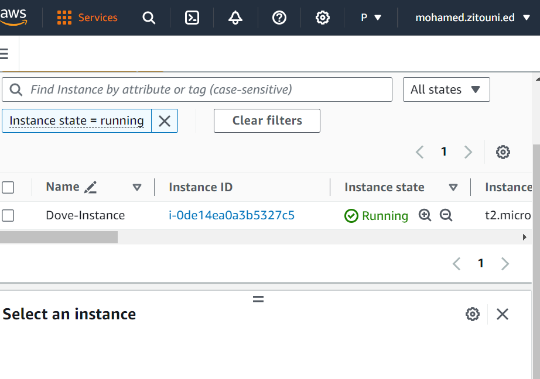

* update the instance and apply the changes

Now we make some changes by adding new tag Project = "Dave"

```
$ terraform validate
$ terraform fmt
$ terraform plan
$ terraform apply
```
* chech state file
the state file used by terraform is:

```
$ cat terraform.tfstate
```

* destroy the instance
Now we will destroy the instance

```
$ terraform destroy
```

### Variables
* Move secrets to another file
* Values that change
  - AMI, tags, keypair etc
* Reuse your code

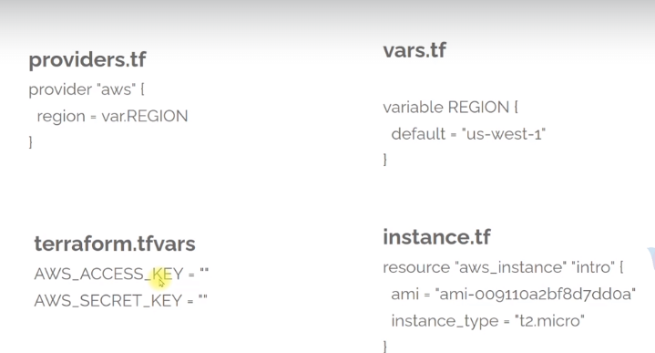

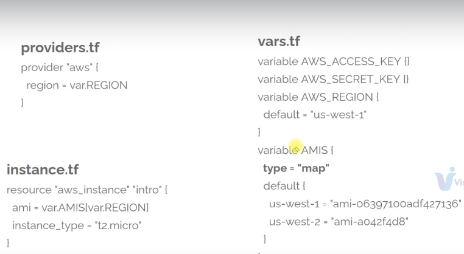

### Exercice 2
```
$ terraform init
$ terraform validate
$ terraform tmf
$ terraform apply
```

* change key-pair

Let us create new key pair and use in in instance.tf file and execute terraform plan command to check if it is possible to change an ec2 instance key-pair

```
$ terraform paln
Plan: 1 to add, 0 to change, 1 to destroy.
```

the plan show us that it will destroy the running instance and create a new one

### provisioning

* Build custom Images with tools like packer
* Use standard Image and use provisioner to setup softwares and files
  - file uploads
  - remote_exec
  - ansible, puppet or chef

#### provisioner Connection

requires connection for provisioning

```
SSH
provisioner "file" {
    source = "files/test.conf"
    destination = "/etc/test.conf"

    connection {
        type = "ssh"
        user = "root"
        password = var.root_password
    }
}
```

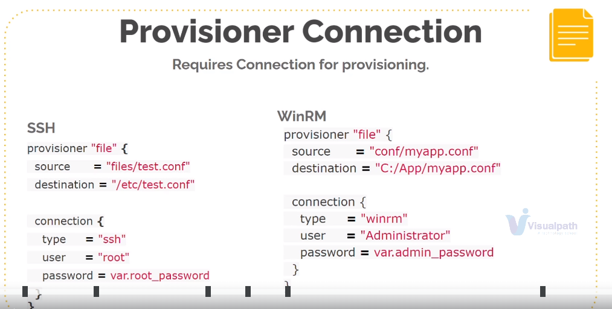

##### More Provisioner
* The file provisioner is used to copy files or directories
* remote-exec invokes a command/script on remote resource.
* local-exec provisioner invokes a local executable after a resource is created.
* The puppet provisioner installs, configures and runs the Puppet agent on a remote resource,
  - Supports both ssh and winrm type connetions
* The chef provisioner installs, configures and runs the Chef client on a remote resource,
  - Supports both ssh and winrm type connections.
* Ansible: run terraform, Output IP address, run playbook with local-exec

### Key Pair $ Instance Resources


We can generate key-par localy using keygen to generate ssh key par and use it to create an instance. the public file will be uploaded to aws account but private key it will still localy.

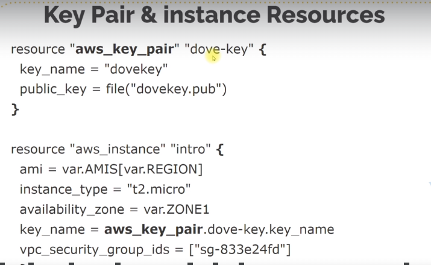

### File provisioner example

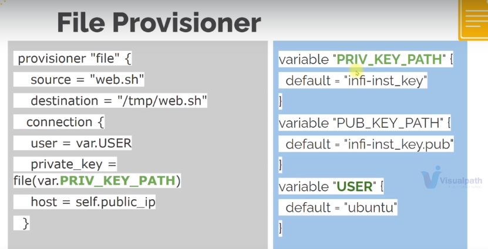

### Remote-exec Provisioner
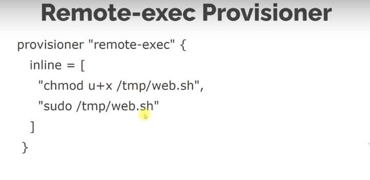


### Exercice 3

* Generate key-par using ssh-keygen
```
$ ssh-keygen
Generating public/private rsa key pair.
Enter file in which to save the key (/c/Users/Utilisateur/.ssh/id_rsa): zitouni-key

$ ls
zitouni-key  zitouni-key.pub

```

* use terraform to create and provision the instance

```
$ terraform init
$ terraform fmt
$ terraform validate
$ terraform plan
terraform apply

```

* To see deployed web site on httpd server
  - change security group to open access on port 80 from myip
  
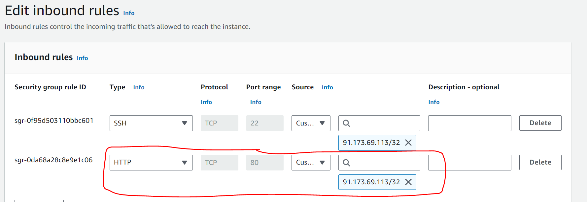


### Output Information

* Terraform stores returned value of all resources created.
  - e:g aws_instance resource has the attribute public_ip
* Use output block to print these attributes
* local-exec to save info to a file

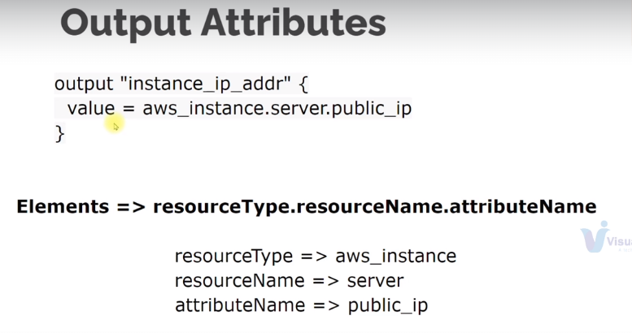

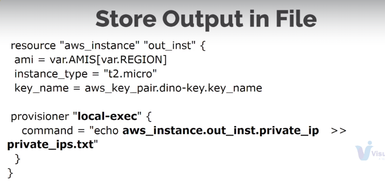

#### exercice 4
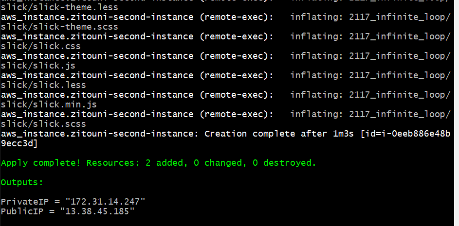

### Exercice 5

*  create new S3 bucket with name terra-state-zitouni
* create in it new folder terraform

```
$ terraform validate
$ terraform plan
$ terraform apply
```

Now the resource are created and the state of terraform is saved in the s3 bucket under /terraform/backend

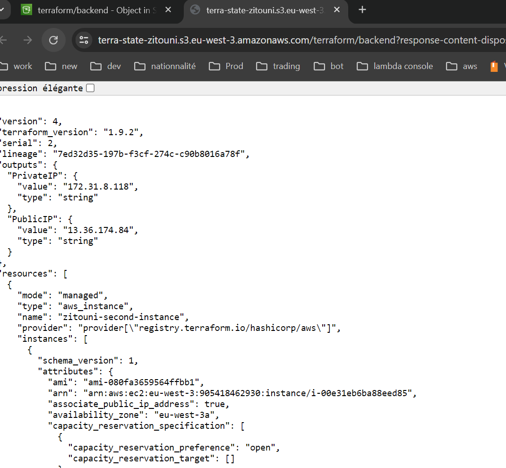

### Documentation by provider

* all providers dicumentation is here : https://registry.terraform.io/namespaces/hashicorp


* aws: https://registry.terraform.io/providers/hashicorp/aws/latest/docs


### Exercice 6

```
$ terraform init
$ terraform validate
$ terraform fmt
$ terraform plan
$ terraform apply
Apply complete! Resources: 12 added, 0 changed, 0 destroyed.
```

### Excervice7
EKS: AWS Elastic Kubernetes Service

* visite terraform modules => published registry: https://registry.terraform.io/browse/modules?ajs_aid=3f99aabd-752c-41ec-8c10-451758b3f5e7&product_intent=terraform

* search for aws vpc module: https://registry.terraform.io/modules/terraform-aws-modules/eks/aws/latest

* search for aws eks module: https://registry.terraform.io/modules/terraform-aws-modules/eks/aws/latest
