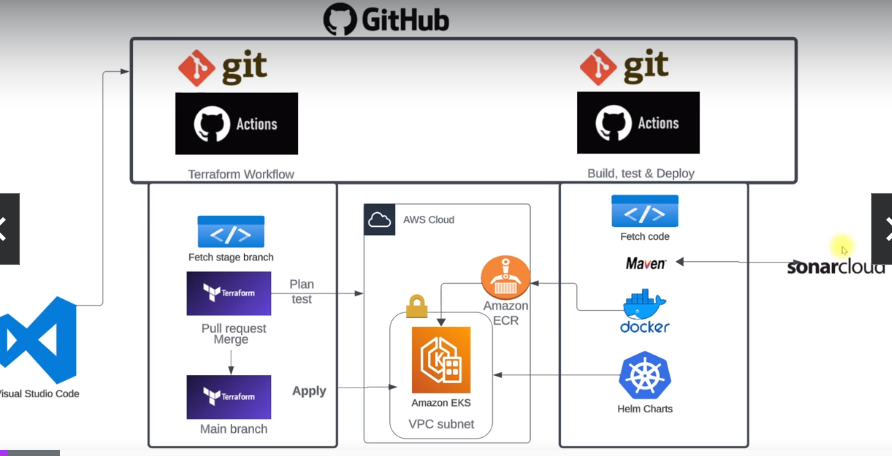

# GitOps
manage everything with git.

### Automation problems
* automatic and also manula
* drift in infrastructure
* no history of changes
* microservices complexity
* no versioning of infra changes

### Git 
* version control system
* how to use for operational level changes
* ci/cd automation code
* infra automation code
* versioning of all the changes
* single place automation code
* restricting users access to only git

### Tools
* tool read changes in git
* apply the differences

* github actions
* gitlab
* argocd
* tekton
* jenkins X

### project architecture

