# ArgoCD
Is a continous delivery tool for kubernetes. It is a CD tool. like Jenkins CD but for kubernetes.
* Jenkins CI workflow (continous integration):
 - application code changes: new feature or bug fixed
 - push the changes to git
 - jenkins ci pipeline is triggered: test and build docker image
 - jenkins push the new image to docker repository
* Jenkins CD workflow (continous delivery)
 - update k8s manifest file (deployment file for example) with the new image tag
 - apply the file to kubernetes (using kubectl for example, or ansible, or helm)

The problem here is that the management of the access to kubernetes cluster. In fact, if we have many projects , then we need to manage their access to the cluster and this is a security issue.

#### With ArgoCD
How ArgoCD make the process efficient?
  - ArgoCD reverse the flow
  - argCD is a part of k8s cluster
  - rather than pushing to the cluster, it pulls the changes and applys them.

Steps to configure agroCD:
  - Deploy argoCD in k8s cluster
  - configure argoCD to track Git repository (for any changes)

Best practice for git repository
  - separate git repository for application source code and application configuration (k8s manifest files, we usualy calls it gitOps repository)
  - Even separate git repository for system configurations
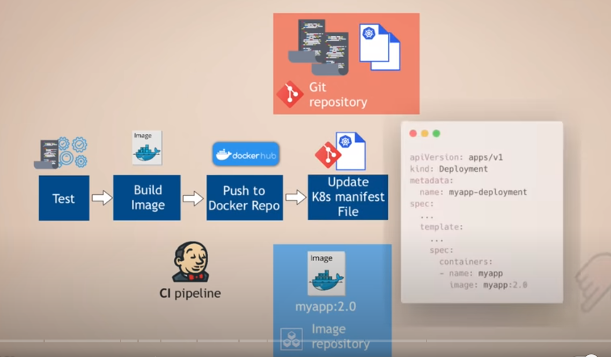

##### Workflow with agroCD
  - application code changes pushed to git repository
  - jenkins ci triggered automatically: test, build, push the image to docker repo
  - update k8s manifest file
  - argocd tracks changes on git repository of application config repository (not source code)
  - pull the changes and apply them to the cluster

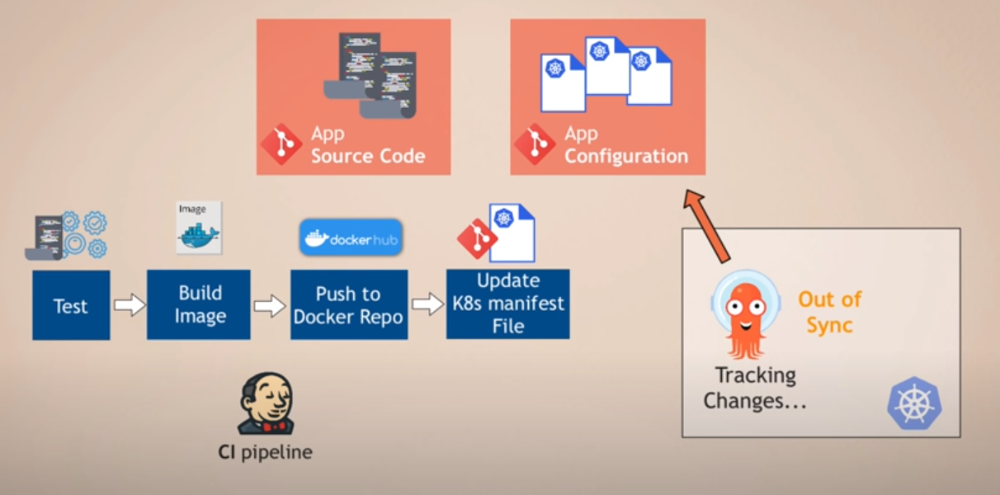

#### ArgoCD supports
- kubernetes yaml files
- helm charts
- kustomize (kustomize.io)

#### Benifets of using argoCD
- Whole k8s configuration defined as Code in Git Repository
- Config Files are not applied manually from local laptops

#### How it works
- ArgoCD watches the changes in the cluster as well
- compares desired configuration in the Git repo with the actual state in the k8s cluster
- agroCD will sync the changes, overwriting the manual changes

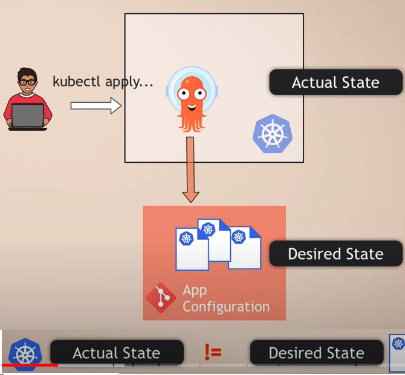

- Easy rollback: just git revert will bring as to a rollback of the cluster

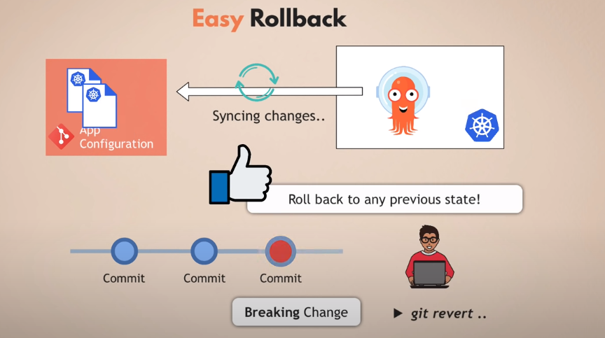

- Espasily we have lots of cluster managed by the same gitops repository
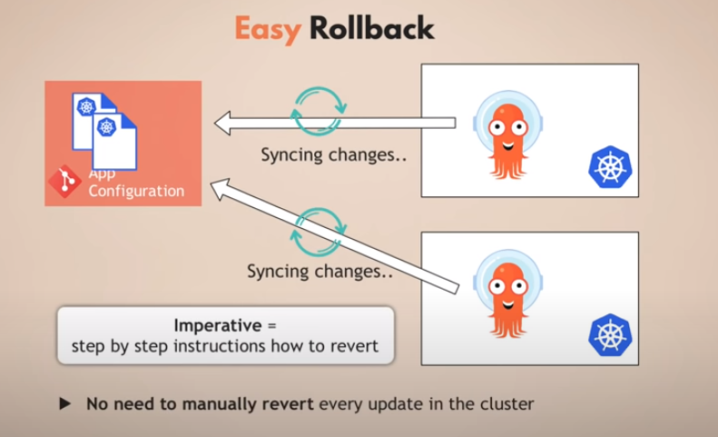

- Cluster disaster recovery is too easy with agroCD
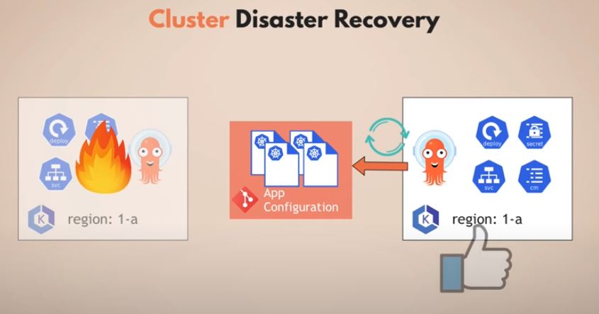

- controll access with git. manage cluster access indirectly with Git. No need to create clusterrole, user resources in kubernetes
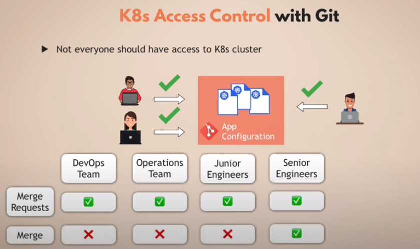

- because of the pull model, we only need to give access to git not to the cluster
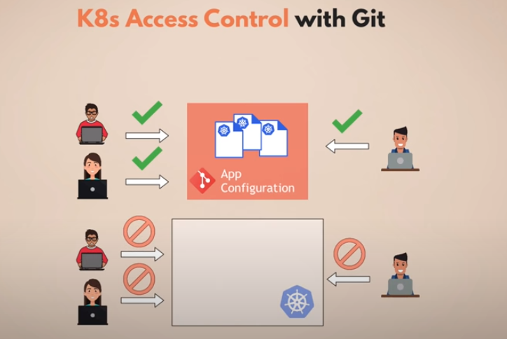

- you don't need to give external access to non human users (like jenkins, ansible). because agroCD can deploy and manage it self the cluster.

- visibility of deployments history in realtime in kubernetes cluster it self
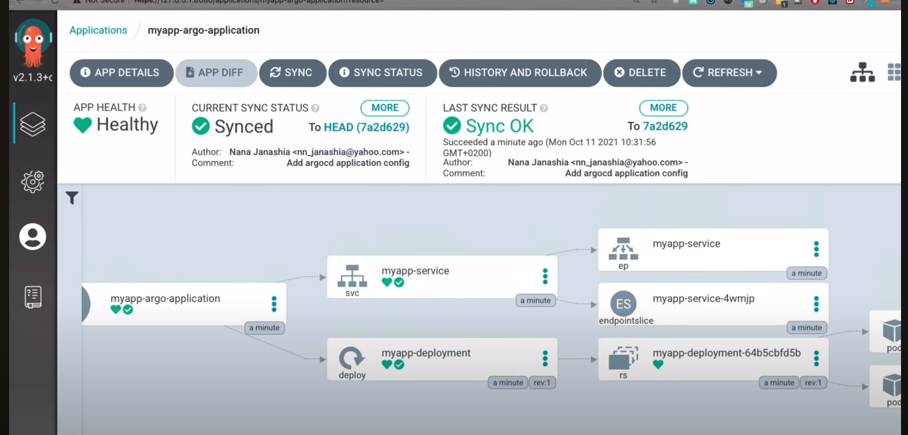

### How to configure AgroCD
Two steps:
  - deploy agrocd in a k8s cluster
  - configure agrocd with k8s yaml file

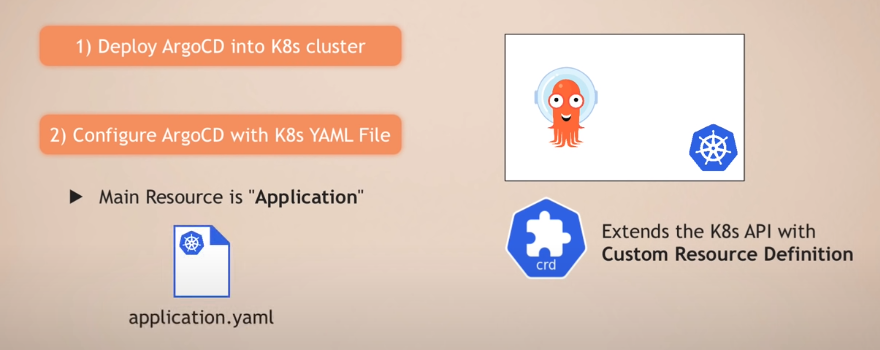

AgroCD it can be installed in the same cluster where the application is deployed or in a separate cluster

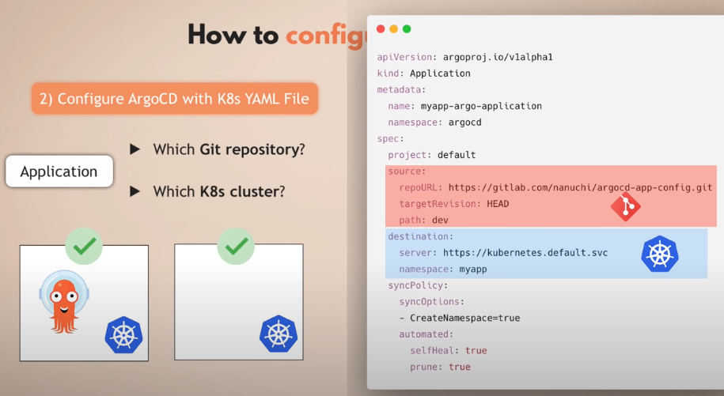

You can use agrocd to deploy many applications (microcervices) or group them and add restrictions on git repositories or namespaces ...

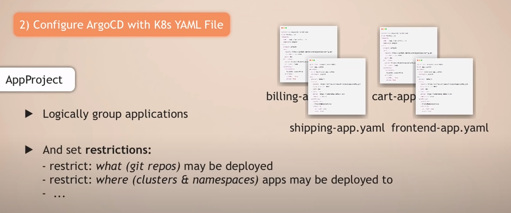

### Working with multiple clusters

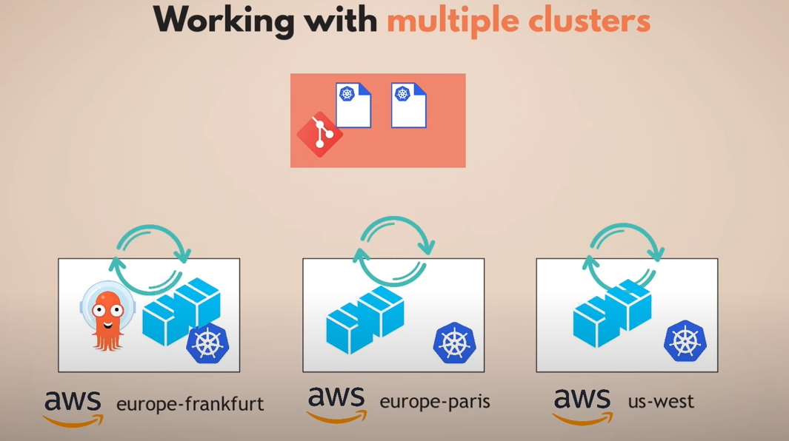

Benefits:
  - Configure and manage just 1 AgroCD
  - Same AgroCD instance is able to sync a fleet of K8s clusters

Multi environments application (dev, staging, prod):
  - in this case we may deploy in each environment an argocd instance

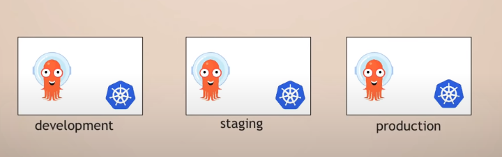

But we still have one git repository and we don't want to deploy it to all environments at once! Instead we want to test the application on each lower envrionment and if it is promoted we deploy it on the next envronment.

For that we have to options:
  - working with multi branchs: dev-branch, staging-branch, prod-branch (not recommanded)
  - using overlays with kustomize: dev, staging, prod overlays

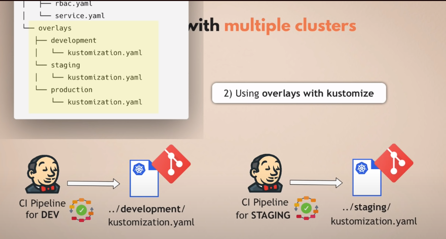

####  ArgoCD sync
ArgoCB by default checks git repository every 3 minutes and synchronizes with it but we can configure a Git hook to avoid this delay.
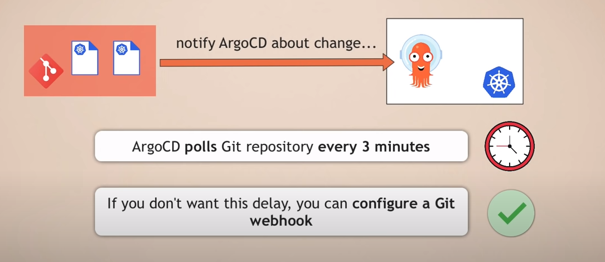