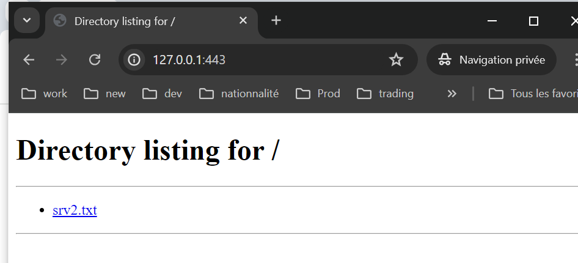
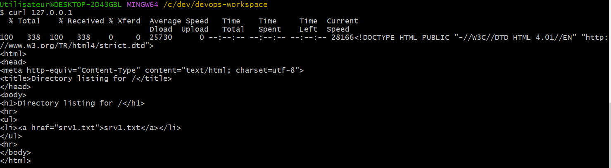

# Traefik
## Introdiction
  +- C'est reverse proxy
  +- filtrage
  +- enrichissement
  +- chiffrement (tls)
  +- compression
  +- load balancing
  +- authentication
  +- langage GO
  +- sa force: 1. discovery (providers: consul, docker, fichiers, ...), 2. échange direct avec let's encrypt (tls)

#### Différentes couches
  - HTTP > osi 7 (applicative)
  - TCP > osi 4 (transport). ex: load balancing des bases des données
  - UDP > osi 4 (transport)

#### Traefik
  - interface graphique
  - exposition de métriques (prometheus routes...)
  - enregistrement du tracing (openmetrics > jaeger)
  - discovery et mise à jour à chaud (ex: swarm)
  - installation: via container (la plus répandu), via binaire
  - configuration: yaml, toml

#### Principes et définitions
* traefik = edge router
  - capacité à analyser pour les fournir aux bons services
* configuration:
  - cli
  - config file (yaml, toml)
  - environment variables
* auto discovery
  - auto découvrir les services qu'il doit servir (sans intervention), très utile pour docker (variation des ip)
* STATIC CONFIGURATION: démarrage > peu modifiée
    * Entrypoints:
        - pint d'entrées
        - ports et adresses: [host]:[port/tcp/udp]
        - redirection
        - forwarding
        - lets encrypt
    * Providers: fournisseurs d'informations (registre de services)
        - docker, kubernetes, consul, ...

* DYNAMIC CONFIGURATION: pendant le process > partie dynamique
  * Routers
    - régles de routages
    - udp/tcp/http
    - host
    - ou les deux
    - path/host > http/https
    - SNI (serveur name indication / TLS)
  * Services
    - 1 service = 1 à multiples instances
    - load balancing
    - règles : sticky session, health check, round robin (weighted)
    - mirroring
  * Middlewares
    - avant envoi de la requete aux services
    - modification: ex - ajout de path, réecriture, basic auth, compress, retry

## Installation
### from binary

#### On ubuntu
```
$ wget https://github.com/traefik/traefik/releases/download/v3.1.0/traefik_v3.1.0_linux_arm64.tar.gz
$ tar xzvf traefik_v3.1.0_darwin_amd64.tar.gz
$ sudo mv traefik /usr/local/bin/
$ sudo chmod 755 /usr/local/bin/traefik
$ mkdir traefik
$ cd traefik
$ sudo traefik --accesslog=true --api=true --api.insecure=true --api.dashboard=true --api.debug=true --log.level=INFO
```

#### On windows
```
# download zip file from https://github.com/traefik/traefik/releases/download/v3.1.0/traefik_v3.1.0_windows_386.zip

# extract it into /c/tools/traefik_v3.1.0_windows_386/

# start traefik server
$ /c/tools/traefik_v3.1.0_windows_386/traefik.exe --accesslog=true --api=true --api.insecure=true --api.dashboard=true --api.debug=true --log.level=INFO
```
##### Ex1
```
$ /c/tools/traefik_v3.1.0_windows_386/traefik.exe --accesslog=true --api=true --api.insecure=true --api.dashboard=true --api.debug=true --log.level=INFO
```


Open the dashbort on http://localhost:8080/dashboard/


##### Ex2

```
$ /c/tools/traefik_v3.1.0_windows_386/traefik.exe -configFile=config.toml
```

##### Ex3

* Create two python http web servers

Server 1: port 8081
```
$ mkdir srv1
$ cd srv1
$ touch srv1.txt
$ $ python3 -m http.server 8081
```

Server 2: port 8082
```
$ mkdir srv2
$ cd srv2
$ touch srv2.txt
$ $ python3 -m http.server 8082
```


Start traefik

```
$ /c/tools/traefik_v3.1.0_windows_386/traefik.exe -configFile=config.toml
```


See loadbalancing between two servers


##### Ex4

* generate two bcrypt passwords using apache2 utlis
```
$ apt install apache2-utils
$ htpasswd -nB medzit
New password:
Re-type new password:
medzit:$2y$05$Mchlo3c4u4Mz3c6InhxPn.IR99mAieKhKO3T6ObsbFnZoKufZBwKy
```

Here the used password is zit534

Now when we open http://127.0.0.1:80 I should enter username/password to acces the web service


##### Ex5

* redirect http to https: see ex5 source code



* config tls certificates
  - generate key, crt files
    ```
    $ openssl req -x509 -newkey rsa:2048 -keyout zitouni.key --out zitouni.crt -days 365 -nodes
    $ ls
    zitouni.key zitouni.crt

    ```

##### Ex6

##### Ex6

Start python http server

```
$ python3 -m http.server 8081
```

Run nginx on docker
```
$ cd ex7/nginx
$ docker-compose up -d
```

Test with curl
```
$ curl 127.0.0.1
```
This will return response from python http server.



##### Ex8
In this example we will run an nginx in a docker container on a virtual machine.
Steps:
1. generate key ssh to be used to ssh into the vm rather than using username/password

```
# on windows
$ ssh-keygen -t rsa -b 4096 -C "your_email@example.com"
# copy public ssh key
$ cat ~/.ssh/id_rsa.pub

# on vm
$ nano ~/.ssh/authorized_keys # and add to it the copied public key
$ chmod 600 ~/.ssh/authorized_keys
$ sudo nano /etc/ssh/sshd_config
PubkeyAuthentication yes
PasswordAuthentication no
$ sudo systemctl restart ssh

# now from windows tel us test ssh into vm using the ssh key
$ ssh jenkinsvm@192.168.1.40
$ exit

# now let us test the ssh docker endpoint before using it with traefik
$ docker -H "ssh://jenkinsvm@192.168.1.40:22" ps
list of docker containers
```

Now let us test
```
$ curl -H "Host:example.com" 127.0.0.1

$ curl 127.0.0.1/example/
```
This will return the nginx index page that running on docker in the vm


##### Ex9
Routers rules:
- clef du header
Headers(`key`, `value`)
- regex dans une clef du header
HeadersRegexp(`key`, `regexp`)
- le host header
Host(`example.com`)
HostHeader(`example.com`)
- regex sur le host header
HostRedexp(`example.com`, ``{subdomain:[a-z]+}.example.com`, ...)
- selection par les méthodes
Method(`GET`, ...)
- sélection via path (exact)
Path(`/path`, `/articles/{cat:[a-z]+}/{id:[0-9]+}`, ...)
- sélection via pathprefix
PathPrefix(`/products/`, `/articles/{cat:[a-z]+}/{id:[0-9]+}`, ...)
- sélection via les paramétres
Query(`foo=bar`)

see example 9

##### Ex 10: tcp mysql host SNI

* use docker compose file to run mysql under the mv
* run traefik ex10
* use mysql.exe client under installed mysql on windows to do some mysql commands
```
$ cd /c/Program Files/MySQL/MySQL Server 8.0/bin
$ ./mysql.exe -uroot -ppaswrd -e 'use webdb; create table if not exists students (id int primary key, firstname varchar(255), lastname varchar(255));'
$ ./mysql.exe -uroot -ppaswrd -e "use webdb; insert into students(id, firstname, lastname) values (1, 'med', 'zit');"
$ ./mysql.exe -uroot -ppaswrd -e 'use webdb; select * from students;'
mysql: [Warning] Using a password on the command line interface can be insecure.
id      firstname       lastname
1       med     zit

```


We can add an other mysql db on different port:
* see mysql2 and config2.toml
* connect to the second mysql database and do sql queries
```
$ ./mysql.exe -uroot -ppaswrd -port 3307 -e 'use webdb; create table if not exists students (id int primary key, firstname varchar(255), lastname varchar(255));'
```

Complete tutorial here: https://gitlab.com/xavki/presentation-traefik-fr

##### White listing
```
[http.middlewares]
  [http.middlewares.filter_by_ip.ipWhiteList]
    sourceRange = ["192.168.13.10/24"]
```

##### Compression
```
middlewares = ["gzip"]
[http.middlewares]
  [http.middlewares.gzip.compress]
```

##### Middleware errors
Do not send anymore errors to client or redirect to a single error page

```
[http.middlewares]
  [http.middlewares.xavki_errors.errors]
    status = ["400-599"]
    service = "xavki_rescue"
    query = "/"
    #query = "/{status}.html"

```